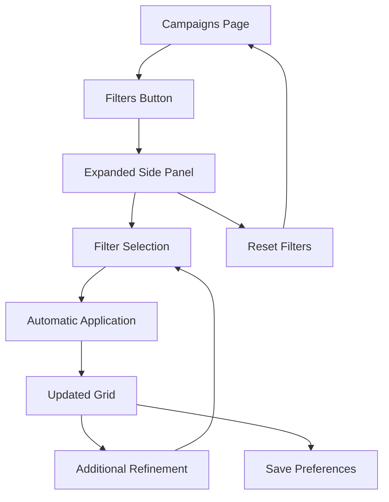

# Advanced Filter System - Campaigns Page

## 1. Product Overview

Advanced filter system for the Campaigns page that allows users to efficiently locate, organize, and analyze campaigns through multiple search and sorting criteria.

The system solves the navigation problem in large campaign volumes, offering intuitive tools for segmentation by visual characteristics, compliance performance, temporal data, and campaign metadata. Designed for marketing professionals and content creators who need to manage multiple campaigns simultaneously.

The goal is to increase productivity by 40% in locating specific campaigns and improve performance analysis through intelligent filters.

## 2. Core Features

### 2.1 User Roles

| Role | Registration Method | Core Permissions |
|------|---------------------|------------------|
| Standard User | Existing login | Can use all filters, save preferences locally |
| Administrator | Administrative access | Can use all filters, access filter usage metrics |

### 2.2 Feature Module

The filter system consists of the following main functionalities:

1. **Filter Panel**: collapsible side interface with all filter controls
2. **Date Filters**: selection by predefined periods or custom dates
3. **Quality Filters**: based on brand compliance scores
4. **Visual Filters**: by dominant colors and aesthetic styles
5. **Content Filters**: text search and categorization by metadata
6. **Sorting System**: multiple organization criteria
7. **State Persistence**: automatic saving of user preferences

### 2.3 Page Details

| Page Name | Module Name | Feature description |
|-----------|-------------|---------------------|
| Campaigns | Filter Panel | Responsive side interface with visibility toggle, organization in collapsible sections, visual indicators of active filters |
| Campaigns | Date Filter | Dropdown with options "Today", "This week", "This month", "Last 3 months" + custom date picker for specific periods |
| Campaigns | Compliance Filter | Range slider for 0-100% scores, visual badges by category (Excellent, Good, Regular, Needs improvement) |
| Campaigns | Text Search | Input with real-time search in title, short description and prompt fields, highlighting of found terms |
| Campaigns | Color Filter | Visual color selector based on palette_hex, preview of dominant colors, multi-selection |
| Campaigns | Style Filter | Multi-select dropdown with styles extracted from image_analysis.styleAesthetic, grouping by categories |
| Campaigns | Budget Filter | Dropdown with categories "Low", "Medium", "High", "Premium" based on input.budget_hint |
| Campaigns | Occasion Filter | Multi-select with occasions extracted from input.occasion, automatic suggestions |
| Campaigns | Audience Filter | Multi-select based on input.audience, demographic segmentation |
| Campaigns | Adjustments Filter | Toggle for campaigns with/without brand_compliance_adjustments, adjustment counter |
| Campaigns | Sorting System | Dropdown with options: date (asc/desc), compliance score (asc/desc), alphabetical (A-Z/Z-A) |
| Campaigns | Local Persistence | Automatic saving to localStorage, restoration on page reload, reset to defaults |

## 3. Core Process

### Main User Flow

1. **Filter Access**: User accesses the Campaigns page and views the "Filters" button next to the status tabs
2. **Filter Selection**: Clicks to expand the side panel and selects desired criteria
3. **Real-time Application**: Filters are applied automatically as selected, updating the campaign grid
4. **Refinement**: User can combine multiple filters to further refine results
5. **Automatic Saving**: Preferences are automatically saved to localStorage
6. **Reset and Clear**: Option to clear all filters or reset to default settings

### Navigation Flow

## 4. User Interface Design

### 4.1 Design Style

- **Primary Colors**: Blue (#3B82F6) for active elements, Gray (#6B7280) for neutral elements
- **Secondary Colors**: Green (#10B981) for positive indicators, Red (#EF4444) for alerts
- **Button Style**: Rounded corners (8px), smooth hover states, pressed states with visual feedback
- **Typography**: Inter 14px for labels, 12px for values, 16px for section titles
- **Layout**: Card-based with subtle shadows, consistent 16px spacing, clear visual hierarchy
- **Icons**: Lucide icons at 16px, outline style, colors consistent with theme

### 4.2 Page Design Overview

| Page Name | Module Name | UI Elements |
|-----------|-------------|-------------|
| Campaigns | Filter Panel | Side card 320px width, white background, shadow-lg, border-radius 12px, z-index 50 for overlay |
| Campaigns | Date Filter | Dropdown with calendar icon, date picker with custom theme, badges for active periods |
| Campaigns | Compliance Filter | Range slider with blue-green gradient, dynamic labels, visual indicators by range |
| Campaigns | Text Search | Input with magnifying glass icon, animated placeholder, clear button, yellow highlight in results |
| Campaigns | Color Filter | 4x4 grid of 24px colored circles, 2px white border, selected state with blue ring |
| Campaigns | Multi-select Filters | Dropdown with checkboxes, internal search, selected count badge, virtual scroll for large lists |
| Campaigns | Adjustments Toggle | Switch component with label, counter badge, clear on/off states |
| Campaigns | Sorting | Dropdown with directional icons, highlighted selected state, smooth transitions |

### 4.3 Responsiveness

Desktop-first with mobile adaptation through:
- Side panel becomes full-screen modal on screens < 768px
- Filters reorganize into vertical accordion
- Touch-friendly with minimum 44px targets
- Swipe gestures to close modal on mobile

## 5. Technical Requirements

### 5.1 Performance
- 300ms debounce for text search
- Virtualization for lists with more than 100 items
- Lazy loading of filter options
- Memoization of filtered results

### 5.2 Accessibility
- Complete keyboard navigation
- Screen reader support with aria-labels
- Minimum AA contrast (4.5:1)
- Visible focus indicators

### 5.3 Compatibility
- Support for modern browsers (Chrome 90+, Firefox 88+, Safari 14+)
- Fallbacks for unavailable localStorage
- Progressive enhancement for disabled JavaScript