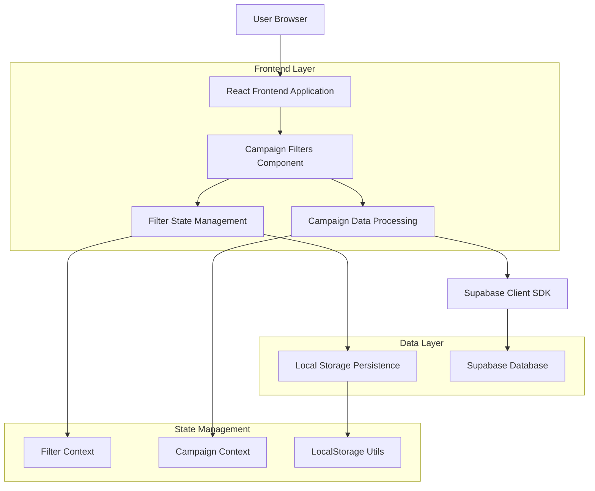
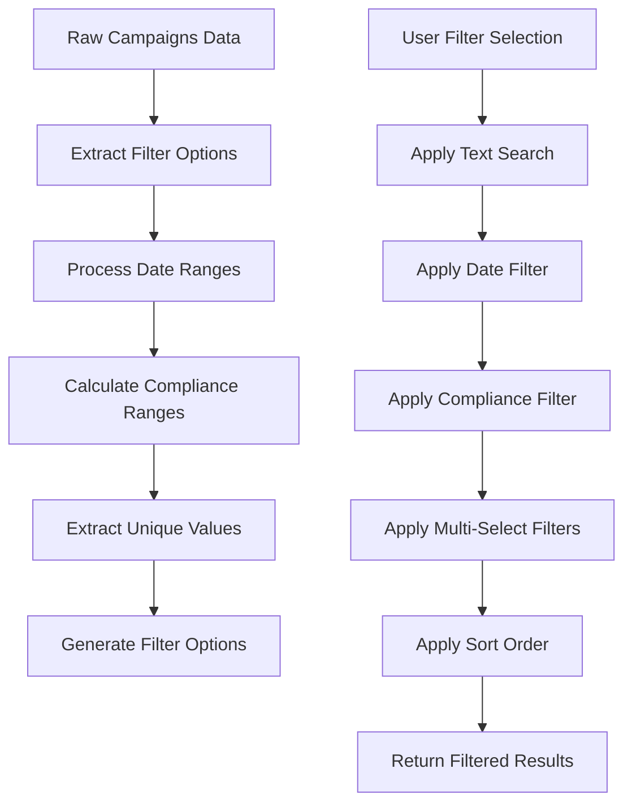

# Technical Architecture - Campaigns Filter System

## 1. Architecture design



## 2. Technology Description

- Frontend: React@18 + TypeScript + Tailwind CSS + shadcn/ui
- State Management: React Context + useState/useReducer
- Data Fetching: TanStack Query + Supabase Client
- Persistence: LocalStorage API
- UI Components: Radix UI + Lucide Icons
- Form Handling: react-hook-form + zod validation

## 3. Route definitions

| Route | Purpose |
|-------|---------|
| /campaigns | Main page with integrated filter system |

## 4. Component Architecture

### 4.1 Core Components

```typescript
// Main filter component
interface CampaignFiltersProps {
  campaigns: Campaign[];
  onFiltersChange: (filteredCampaigns: Campaign[]) => void;
  isOpen: boolean;
  onToggle: () => void;
}

// Filter state
interface FilterState {
  search: string;
  dateRange: {
    start?: Date;
    end?: Date;
    preset?: 'today' | 'week' | 'month' | 'quarter';
  };
  complianceScore: {
    min: number;
    max: number;
  };
  colors: string[];
  styles: string[];
  budget: string[];
  occasions: string[];
  audiences: string[];
  hasAdjustments?: boolean;
  sortBy: 'date' | 'compliance' | 'title';
  sortOrder: 'asc' | 'desc';
}
```

### 4.2 Filter Components

**DateRangeFilter**
```typescript
interface DateRangeFilterProps {
  value: FilterState['dateRange'];
  onChange: (dateRange: FilterState['dateRange']) => void;
}
```

**ComplianceScoreFilter**
```typescript
interface ComplianceScoreFilterProps {
  value: FilterState['complianceScore'];
  onChange: (range: FilterState['complianceScore']) => void;
}
```

**MultiSelectFilter**
```typescript
interface MultiSelectFilterProps {
  options: Array<{ value: string; label: string; count?: number }>;
  value: string[];
  onChange: (selected: string[]) => void;
  placeholder: string;
  searchable?: boolean;
}
```

**ColorFilter**
```typescript
interface ColorFilterProps {
  availableColors: string[];
  selectedColors: string[];
  onChange: (colors: string[]) => void;
}
```

## 5. Data Processing Pipeline

### 5.1 Filter Processing Flow



### 5.2 Filter Functions

```typescript
// Main filter function
const applyFilters = (
  campaigns: Campaign[],
  filters: FilterState
): Campaign[] => {
  return campaigns
    .filter(applyTextSearch(filters.search))
    .filter(applyDateRange(filters.dateRange))
    .filter(applyComplianceScore(filters.complianceScore))
    .filter(applyColorFilter(filters.colors))
    .filter(applyStyleFilter(filters.styles))
    .filter(applyBudgetFilter(filters.budget))
    .filter(applyOccasionFilter(filters.occasions))
    .filter(applyAudienceFilter(filters.audiences))
    .filter(applyAdjustmentsFilter(filters.hasAdjustments))
    .sort(applySorting(filters.sortBy, filters.sortOrder));
};

// Filter options extraction
const extractFilterOptions = (campaigns: Campaign[]) => {
  return {
    colors: extractUniqueColors(campaigns),
    styles: extractUniqueStyles(campaigns),
    budgets: extractUniqueBudgets(campaigns),
    occasions: extractUniqueOccasions(campaigns),
    audiences: extractUniqueAudiences(campaigns),
    complianceRange: calculateComplianceRange(campaigns),
    dateRange: calculateDateRange(campaigns)
  };
};
```

## 6. State Management Architecture

### 6.1 Filter Context

```typescript
interface FilterContextType {
  filters: FilterState;
  setFilters: (filters: Partial<FilterState>) => void;
  resetFilters: () => void;
  filteredCampaigns: Campaign[];
  filterOptions: FilterOptions;
  isLoading: boolean;
}

const FilterContext = createContext<FilterContextType | null>(null);
```

### 6.2 LocalStorage Integration

```typescript
// Filter persistence
const STORAGE_KEY = 'campaign-filters-v1';

const saveFiltersToStorage = (filters: FilterState) => {
  try {
    localStorage.setItem(STORAGE_KEY, JSON.stringify(filters));
  } catch (error) {
    console.warn('Failed to save filters to localStorage:', error);
  }
};

const loadFiltersFromStorage = (): Partial<FilterState> => {
  try {
    const stored = localStorage.getItem(STORAGE_KEY);
    return stored ? JSON.parse(stored) : {};
  } catch (error) {
    console.warn('Failed to load filters from localStorage:', error);
    return {};
  }
};
```

## 7. Performance Optimizations

### 7.1 Memoization Strategy

```typescript
// Memoization of filtered results
const filteredCampaigns = useMemo(() => {
  return applyFilters(campaigns, filters);
}, [campaigns, filters]);

// Memoization of filter options
const filterOptions = useMemo(() => {
  return extractFilterOptions(campaigns);
}, [campaigns]);

// Debounce for text search
const debouncedSearch = useDebounce(filters.search, 300);
```

### 7.2 Virtual Scrolling

```typescript
// For large option lists
const VirtualizedFilterList = ({ options, selected, onChange }) => {
  const [virtualizer] = useVirtualizer({
    count: options.length,
    getScrollElement: () => parentRef.current,
    estimateSize: () => 40,
    overscan: 5,
  });

  return (
    <div ref={parentRef} className="h-64 overflow-auto">
      {virtualizer.getVirtualItems().map((virtualItem) => (
        <FilterOption
          key={virtualItem.key}
          option={options[virtualItem.index]}
          selected={selected.includes(options[virtualItem.index].value)}
          onChange={onChange}
        />
      ))}
    </div>
  );
};
```

## 8. File Structure

```
src/
├── components/
│   ├── filters/
│   │   ├── CampaignFilters.tsx           # Main component
│   │   ├── DateRangeFilter.tsx           # Date filter
│   │   ├── ComplianceScoreFilter.tsx     # Compliance filter
│   │   ├── ColorFilter.tsx               # Color filter
│   │   ├── MultiSelectFilter.tsx         # Multi-select filter
│   │   ├── SearchFilter.tsx              # Text search
│   │   ├── SortFilter.tsx                # Sorting
│   │   └── FilterPanel.tsx               # Side panel
│   └── ui/
│       ├── range-slider.tsx              # Custom slider
│       ├── color-picker.tsx              # Color picker
│       └── multi-select.tsx              # Custom multi-select
├── hooks/
│   ├── useFilters.tsx                    # Main filters hook
│   ├── useFilterOptions.tsx              # Options hook
│   ├── useFilterPersistence.tsx          # localStorage hook
│   └── useDebounce.tsx                   # Debounce hook
├── lib/
│   ├── filterUtils.ts                    # Filter utilities
│   ├── dateUtils.ts                      # Date utilities
│   └── colorUtils.ts                     # Color utilities
├── types/
│   └── filters.ts                        # TypeScript types
└── contexts/
    └── FilterContext.tsx                 # Filter context
```

## 9. Integration Points

### 9.1 Campaigns Page Integration

```typescript
// Campaigns page modifications
const Campaigns = () => {
  const [filtersOpen, setFiltersOpen] = useState(false);
  const { filteredCampaigns, filters, setFilters } = useFilters(campaigns);

  return (
    <FilterProvider>
      <div className="flex">
        <main className="flex-1">
          {/* Existing content */}
          <div className="flex justify-between items-center">
            <Tabs value={statusFilter} onValueChange={setStatusFilter}>
              {/* Existing tabs */}
            </Tabs>
            <Button
              variant="outline"
              onClick={() => setFiltersOpen(true)}
              className="flex items-center gap-2"
            >
              <Filter className="h-4 w-4" />
              Filters
              {hasActiveFilters && (
                <Badge variant="secondary">{activeFilterCount}</Badge>
              )}
            </Button>
          </div>
          
          <CampaignGrid campaigns={filteredCampaigns} />
        </main>
        
        <CampaignFilters
          isOpen={filtersOpen}
          onClose={() => setFiltersOpen(false)}
          campaigns={campaigns}
        />
      </div>
    </FilterProvider>
  );
};
```

## 10. Testing Strategy

### 10.1 Unit Tests

```typescript
// Filter function tests
describe('Filter Utils', () => {
  test('applyTextSearch filters campaigns by title', () => {
    const campaigns = [
      { title: 'Summer Collection', ... },
      { title: 'Winter Sale', ... }
    ];
    const result = applyTextSearch('summer')(campaigns);
    expect(result).toHaveLength(1);
    expect(result[0].title).toBe('Summer Collection');
  });

  test('applyComplianceScore filters by score range', () => {
    const campaigns = [
      { brand_compliance_score: 85, ... },
      { brand_compliance_score: 65, ... }
    ];
    const result = applyComplianceScore({ min: 70, max: 100 })(campaigns);
    expect(result).toHaveLength(1);
    expect(result[0].brand_compliance_score).toBe(85);
  });
});
```

### 10.2 Integration Tests

```typescript
// Integration tests with React Testing Library
describe('CampaignFilters Integration', () => {
  test('filters campaigns when search is applied', async () => {
    render(<CampaignsWithFilters campaigns={mockCampaigns} />);
    
    const searchInput = screen.getByPlaceholderText('Search campaigns...');
    fireEvent.change(searchInput, { target: { value: 'summer' } });
    
    await waitFor(() => {
      expect(screen.getByText('Summer Collection')).toBeInTheDocument();
      expect(screen.queryByText('Winter Sale')).not.toBeInTheDocument();
    });
  });
});
```

## 11. Deployment Considerations

### 11.1 Bundle Size Optimization

- Tree shaking for unused components
- Code splitting for complex filters
- Lazy loading of filter components

### 11.2 Browser Compatibility

- Polyfills for modern APIs (Intersection Observer, ResizeObserver)
- Fallbacks for unavailable localStorage
- Progressive enhancement for disabled JavaScript