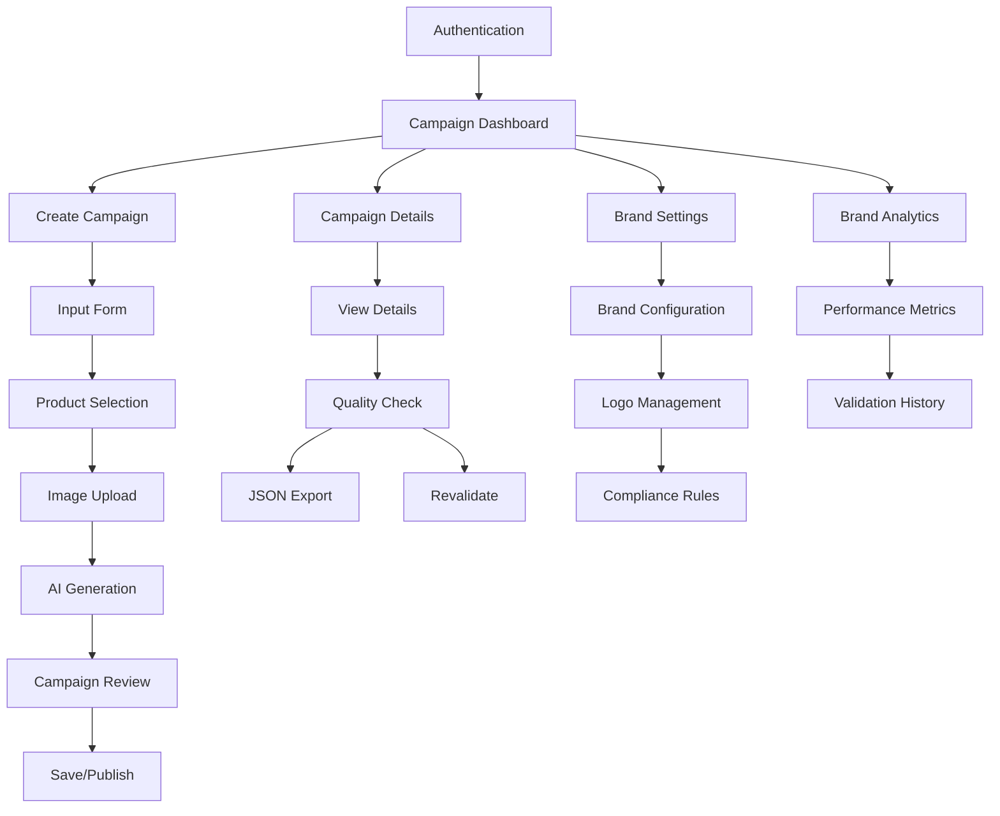

# Fashion Campaign AI - Product Documentation

## 1. Product Overview

Fashion Campaign AI is an advanced AI-powered platform designed to revolutionize fashion marketing campaign creation. The platform enables fashion brands and marketers to generate comprehensive, brand-compliant marketing campaigns through intelligent automation, combining visual AI, brand governance, and content generation capabilities.

- **Primary Purpose**: Streamline fashion campaign creation by automating content generation, ensuring brand compliance, and providing comprehensive analytics for marketing optimization.
- **Target Users**: Fashion brands, marketing agencies, content creators, and e-commerce businesses seeking to create professional, on-brand marketing campaigns efficiently.
- **Market Value**: Reduces campaign creation time by 80%, ensures consistent brand compliance, and provides data-driven insights for marketing optimization.

## 2. Core Features

### 2.1 User Roles

| Role | Registration Method | Core Permissions |
|------|---------------------|------------------|
| Authenticated User | Email/password registration via Supabase Auth | Full access to campaign creation, brand settings, analytics, and product repository management |
| Anonymous User | No registration required | Limited access to authentication pages only |

### 2.2 Feature Module

Our Fashion Campaign AI platform consists of the following main pages:

1. **Authentication Page**: User login and registration with secure authentication
2. **Campaign Dashboard**: Campaign overview, management, and analytics with filtering capabilities
3. **Campaign Creation**: AI-powered campaign generation with product selection and brand compliance
4. **Campaign Details**: Comprehensive campaign view with quality indicators and JSON export
5. **Brand Analytics**: Performance metrics, compliance tracking, and campaign insights
6. **Brand Settings**: Brand book configuration, logo management, and compliance rules

### 2.3 Page Details

| Page Name | Module Name | Feature Description |
|-----------|-------------|---------------------|
| Authentication | Login/Register Form | Secure user authentication via Supabase Auth with email/password validation |
| Campaign Dashboard | Campaign List | Display all user campaigns with status badges, compliance scores, and action buttons |
| Campaign Dashboard | Filter System | Advanced filtering by status, compliance score, creation date, and search functionality |
| Campaign Dashboard | Onboarding Tour | Interactive guided tour for new users with step-by-step feature introduction |
| Campaign Creation | Input Form | Campaign title, look description input with rich text support and validation |
| Campaign Creation | Product Selection | Interactive product repository with dress and accessory selection from curated collections |
| Campaign Creation | Image Upload | Model image upload with format validation and optional brand logo integration |
| Campaign Creation | AI Generation | Generate complete campaigns using OpenAI integration with brand compliance validation |
| Campaign Details | Campaign Overview | Display campaign metadata, status, creation date, and quality indicators |
| Campaign Details | Product Images | Showcase centerpiece, model, and accessory images with intelligent asset resolution |
| Campaign Details | Quality Indicators | Brand compliance score, JSON schema validation status with detailed tooltips |
| Campaign Details | JSON Export | Download campaign data as structured JSON with LookPost format compatibility |
| Campaign Details | Revalidation | Re-run brand compliance validation with updated brand settings |
| Brand Analytics | Performance Metrics | Campaign performance tracking, compliance trends, and success rate analytics |
| Brand Analytics | Validation History | Historical validation data with adjustment tracking and improvement suggestions |
| Brand Settings | Brand Book Configuration | Define brand voice, target audience, preferred vocabulary, and content rules |
| Brand Settings | Logo Management | Upload and position brand logos with format validation and size optimization |
| Brand Settings | Compliance Rules | Configure validation strictness levels and custom brand compliance criteria |

## 3. Core Process

### Main User Operation Flow

**Campaign Creation Flow:**
1. User logs in through secure authentication
2. Navigates to Campaign Dashboard to view existing campaigns
3. Clicks "Create New Campaign" to start campaign creation process
4. Fills campaign details (title, description) and selects products from repository
5. Optionally uploads model image and configures brand logo placement
6. Generates AI-powered campaign content with brand compliance validation
7. Reviews generated content, quality scores, and compliance indicators
8. Saves campaign as draft or publishes for immediate use
9. Downloads campaign JSON for external platform integration

**Brand Management Flow:**
1. User accesses Brand Settings to configure brand identity
2. Uploads brand logo and defines positioning preferences
3. Configures brand book with tone of voice, target audience, and content rules
4. Sets validation strictness level and custom compliance criteria
5. Reviews brand analytics to track compliance performance
6. Adjusts brand settings based on campaign performance insights

## 4. User Interface Design

### 4.1 Design Style

- **Primary Colors**: Slate-based color palette with CSS variables for theme consistency
- **Secondary Colors**: Accent colors for status indicators (green for approved, yellow for adequate, red for attention required)
- **Button Style**: Modern rounded buttons with subtle shadows and hover effects using Tailwind CSS
- **Typography**: System font stack with clear hierarchy, 14px base size for body text, larger sizes for headings
- **Layout Style**: Card-based design with clean spacing, top navigation with user dropdown, responsive grid layouts
- **Icons**: Lucide React icon library for consistent iconography throughout the interface
- **Animation**: Subtle transitions and hover effects using Tailwind CSS animations

### 4.2 Page Design Overview

| Page Name | Module Name | UI Elements |
|-----------|-------------|-------------|
| Authentication | Login Form | Centered card layout with branded header, input fields with validation states, primary action buttons |
| Campaign Dashboard | Campaign Grid | Responsive card grid with campaign thumbnails, status badges, compliance scores, and action dropdowns |
| Campaign Dashboard | Filter Panel | Collapsible sidebar with search input, status filters, date pickers, and clear filter options |
| Campaign Creation | Form Layout | Multi-step form with progress indicators, tabbed sections, and real-time validation feedback |
| Campaign Creation | Product Gallery | Modal overlay with product grid, selection indicators, and category tabs for easy navigation |
| Campaign Details | Content Display | Two-column layout with campaign metadata on left, visual content on right, expandable sections |
| Campaign Details | Quality Panel | Status cards with color-coded indicators, progress bars for scores, and informational tooltips |
| Brand Analytics | Dashboard Layout | Chart containers with responsive design, metric cards, and interactive data visualization |
| Brand Settings | Configuration Panel | Tabbed interface with form sections, file upload areas, and preview components |

### 4.3 Responsiveness

The platform is designed with a mobile-first approach, ensuring optimal experience across all device sizes:

- **Desktop-first design** with responsive breakpoints at 768px (tablet) and 1024px (desktop)
- **Touch interaction optimization** for mobile devices with appropriate touch targets and gesture support
- **Adaptive layouts** that stack vertically on smaller screens while maintaining functionality
- **Responsive typography** that scales appropriately across different screen sizes
- **Mobile navigation** with collapsible menus and touch-friendly interface elements