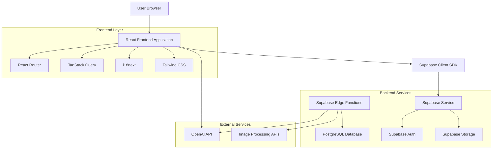
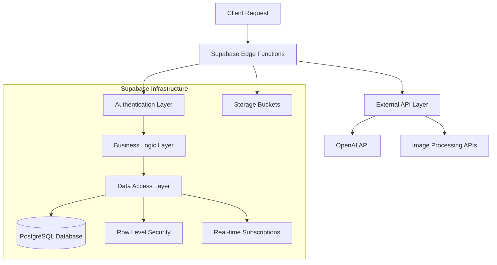
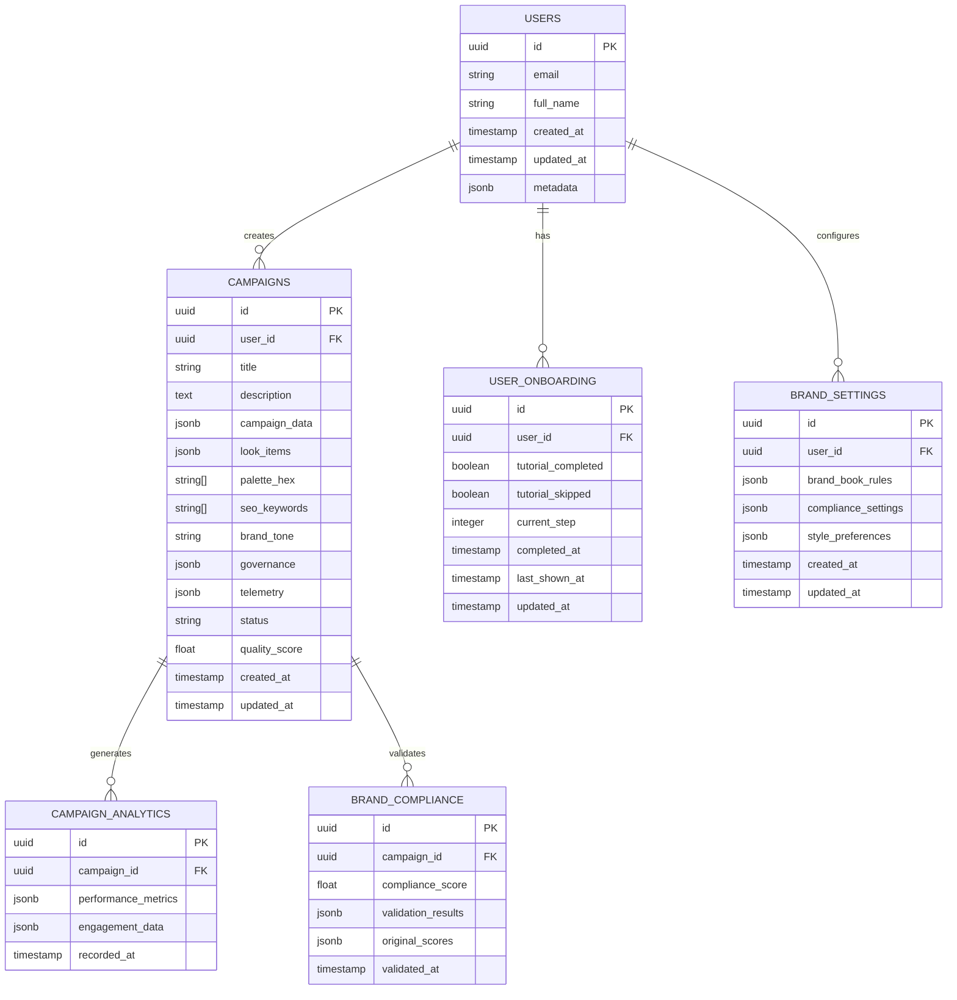

# Technical Architecture Document
## Fashion Campaign AI Platform

### 1. Architecture Design



### 2. Technology Description

**Frontend Stack:**
- React 18 with TypeScript (strict mode)
- Vite as build tool and development server
- React Router v6 for client-side routing
- TanStack Query (React Query) for server state management
- Tailwind CSS for styling
- shadcn/ui + Radix UI for component library
- react-hook-form + zod for form validation
- react-i18next for internationalization
- Lucide React for icons

**Backend Stack:**
- Supabase (Backend-as-a-Service)
- PostgreSQL database (managed by Supabase)
- Supabase Auth for authentication
- Supabase Edge Functions (Deno runtime)
- Supabase Storage for file management

**External Integrations:**
- OpenAI API for AI content generation
- Image processing and optimization services

### 3. Route Definitions

| Route | Purpose | Authentication Required |
|-------|---------|------------------------|
| `/` | Dashboard - Campaign overview and management | Yes |
| `/auth` | Authentication page (login/register) | No |
| `/create` | Campaign creation wizard | Yes |
| `/campaign/:id` | Campaign details and editing | Yes |
| `/settings` | User settings and brand configuration | Yes |
| `/onboarding` | User onboarding flow | Yes |

### 4. API Definitions

#### 4.1 Supabase Edge Functions

**Campaign Generation**
```
POST /functions/v1/generate-campaign
```

Request:
| Param Name | Param Type | Required | Description |
|------------|------------|----------|-------------|
| prompt | string | true | Campaign generation prompt |
| brand_settings | object | true | Brand compliance settings |
| target_audience | string | false | Target audience description |

Response:
| Param Name | Param Type | Description |
|------------|------------|-------------|
| campaign_data | object | Generated campaign content |
| quality_score | number | Campaign quality assessment |
| compliance_status | string | Brand compliance validation |

**Content Validation**
```
POST /functions/v1/validate-content
```

Request:
| Param Name | Param Type | Required | Description |
|------------|------------|----------|-------------|
| content | object | true | Campaign content to validate |
| schema_version | string | true | JSON Schema version |

Response:
| Param Name | Param Type | Description |
|------------|------------|-------------|
| is_valid | boolean | Validation result |
| errors | array | Validation errors if any |
| suggestions | array | Improvement suggestions |

**Campaign Revalidation**
```
POST /functions/v1/revalidate-campaign
```

Request:
| Param Name | Param Type | Required | Description |
|------------|------------|----------|-------------|
| campaign_id | string | true | Campaign UUID |

Response:
| Param Name | Param Type | Description |
|------------|------------|-------------|
| updated_campaign | object | Revalidated campaign data |
| quality_changes | object | Quality score changes |

#### 4.2 Database API (via Supabase Client)

**Campaigns Table Operations**
```typescript
// Fetch campaigns
const { data, error } = await supabase
  .from('campaigns')
  .select('*')
  .order('created_at', { ascending: false });

// Create campaign
const { data, error } = await supabase
  .from('campaigns')
  .insert(campaignData);

// Update campaign
const { data, error } = await supabase
  .from('campaigns')
  .update(updates)
  .eq('id', campaignId);
```

### 5. Server Architecture Diagram



### 6. Data Model

#### 6.1 Data Model Definition



#### 6.2 Data Definition Language

**Users Table (managed by Supabase Auth)**
```sql
-- Supabase Auth automatically creates auth.users table
-- Custom user profiles table
CREATE TABLE public.profiles (
    id UUID REFERENCES auth.users(id) PRIMARY KEY,
    email VARCHAR(255) UNIQUE NOT NULL,
    full_name VARCHAR(100),
    avatar_url TEXT,
    created_at TIMESTAMP WITH TIME ZONE DEFAULT NOW(),
    updated_at TIMESTAMP WITH TIME ZONE DEFAULT NOW()
);

-- Enable RLS
ALTER TABLE public.profiles ENABLE ROW LEVEL SECURITY;

-- RLS Policies
CREATE POLICY "Users can view own profile" ON public.profiles
    FOR SELECT USING (auth.uid() = id);

CREATE POLICY "Users can update own profile" ON public.profiles
    FOR UPDATE USING (auth.uid() = id);
```

**Campaigns Table**
```sql
CREATE TABLE public.campaigns (
    id UUID PRIMARY KEY DEFAULT gen_random_uuid(),
    user_id UUID REFERENCES auth.users(id) NOT NULL,
    title VARCHAR(255) NOT NULL,
    description TEXT,
    campaign_data JSONB NOT NULL DEFAULT '{}',
    look_items JSONB DEFAULT '[]',
    palette_hex TEXT[] DEFAULT '{}',
    seo_keywords TEXT[] DEFAULT '{}',
    brand_tone VARCHAR(100),
    governance JSONB DEFAULT '{}',
    telemetry JSONB DEFAULT '{}',
    status VARCHAR(50) DEFAULT 'draft' CHECK (status IN ('draft', 'validating', 'approved', 'published', 'archived')),
    quality_score DECIMAL(3,2) DEFAULT 0.0,
    created_at TIMESTAMP WITH TIME ZONE DEFAULT NOW(),
    updated_at TIMESTAMP WITH TIME ZONE DEFAULT NOW()
);

-- Indexes
CREATE INDEX idx_campaigns_user_id ON public.campaigns(user_id);
CREATE INDEX idx_campaigns_status ON public.campaigns(status);
CREATE INDEX idx_campaigns_created_at ON public.campaigns(created_at DESC);
CREATE INDEX idx_campaigns_quality_score ON public.campaigns(quality_score DESC);

-- Enable RLS
ALTER TABLE public.campaigns ENABLE ROW LEVEL SECURITY;

-- RLS Policies
CREATE POLICY "Users can view own campaigns" ON public.campaigns
    FOR SELECT USING (auth.uid() = user_id);

CREATE POLICY "Users can create campaigns" ON public.campaigns
    FOR INSERT WITH CHECK (auth.uid() = user_id);

CREATE POLICY "Users can update own campaigns" ON public.campaigns
    FOR UPDATE USING (auth.uid() = user_id);

CREATE POLICY "Users can delete own campaigns" ON public.campaigns
    FOR DELETE USING (auth.uid() = user_id);
```

**User Onboarding Table**
```sql
CREATE TABLE public.user_onboarding (
    id UUID PRIMARY KEY DEFAULT gen_random_uuid(),
    user_id UUID REFERENCES auth.users(id) UNIQUE NOT NULL,
    tutorial_completed BOOLEAN DEFAULT FALSE,
    tutorial_skipped BOOLEAN DEFAULT FALSE,
    current_step INTEGER DEFAULT 0,
    completed_at TIMESTAMP WITH TIME ZONE,
    last_shown_at TIMESTAMP WITH TIME ZONE,
    updated_at TIMESTAMP WITH TIME ZONE DEFAULT NOW()
);

-- Enable RLS
ALTER TABLE public.user_onboarding ENABLE ROW LEVEL SECURITY;

-- RLS Policies
CREATE POLICY "Users can manage own onboarding" ON public.user_onboarding
    FOR ALL USING (auth.uid() = user_id);
```

**Brand Settings Table**
```sql
CREATE TABLE public.brand_settings (
    id UUID PRIMARY KEY DEFAULT gen_random_uuid(),
    user_id UUID REFERENCES auth.users(id) UNIQUE NOT NULL,
    brand_book_rules JSONB DEFAULT '{}',
    compliance_settings JSONB DEFAULT '{}',
    style_preferences JSONB DEFAULT '{}',
    created_at TIMESTAMP WITH TIME ZONE DEFAULT NOW(),
    updated_at TIMESTAMP WITH TIME ZONE DEFAULT NOW()
);

-- Enable RLS
ALTER TABLE public.brand_settings ENABLE ROW LEVEL SECURITY;

-- RLS Policies
CREATE POLICY "Users can manage own brand settings" ON public.brand_settings
    FOR ALL USING (auth.uid() = user_id);
```

**Brand Compliance Table**
```sql
CREATE TABLE public.brand_compliance (
    id UUID PRIMARY KEY DEFAULT gen_random_uuid(),
    campaign_id UUID REFERENCES public.campaigns(id) ON DELETE CASCADE,
    compliance_score DECIMAL(3,2) DEFAULT 0.0,
    validation_results JSONB DEFAULT '{}',
    original_scores JSONB DEFAULT '{}',
    validated_at TIMESTAMP WITH TIME ZONE DEFAULT NOW()
);

-- Indexes
CREATE INDEX idx_brand_compliance_campaign_id ON public.brand_compliance(campaign_id);
CREATE INDEX idx_brand_compliance_score ON public.brand_compliance(compliance_score DESC);

-- Enable RLS
ALTER TABLE public.brand_compliance ENABLE ROW LEVEL SECURITY;

-- RLS Policies
CREATE POLICY "Users can view compliance for own campaigns" ON public.brand_compliance
    FOR SELECT USING (
        EXISTS (
            SELECT 1 FROM public.campaigns 
            WHERE campaigns.id = brand_compliance.campaign_id 
            AND campaigns.user_id = auth.uid()
        )
    );
```

### 7. Security Architecture

#### 7.1 Authentication & Authorization
- **Supabase Auth**: JWT-based authentication with secure token management
- **Row Level Security (RLS)**: Database-level access control
- **Role-based Access**: User-specific data isolation

#### 7.2 Data Security
- **Input Validation**: Zod schemas for all user inputs
- **SQL Injection Prevention**: Parameterized queries via Supabase client
- **XSS Protection**: React's built-in XSS prevention + content sanitization

#### 7.3 API Security
- **Rate Limiting**: Implemented in Edge Functions
- **CORS Configuration**: Restricted to allowed origins
- **Environment Variables**: Secure secret management

### 8. Deployment Architecture

#### 8.1 Frontend Deployment
- **Platform**: Vercel (recommended) or Netlify
- **Build Process**: Vite production build
- **Environment Variables**: Supabase URL and keys
- **CDN**: Automatic via deployment platform

#### 8.2 Backend Deployment
- **Supabase Cloud**: Managed PostgreSQL and Edge Functions
- **Database Migrations**: Version-controlled SQL migrations
- **Environment Management**: Separate staging/production environments

#### 8.3 CI/CD Pipeline
```yaml
# Example GitHub Actions workflow
name: Deploy
on:
  push:
    branches: [main]
jobs:
  deploy:
    runs-on: ubuntu-latest
    steps:
      - uses: actions/checkout@v3
      - uses: actions/setup-node@v3
      - run: npm ci
      - run: npm run build
      - run: npm run test
      - uses: supabase/setup-cli@v1
      - run: supabase db push
```

### 9. Performance Considerations

#### 9.1 Frontend Optimization
- **Code Splitting**: React.lazy() for route-based splitting
- **Image Optimization**: Lazy loading and responsive images
- **Caching**: TanStack Query for intelligent data caching
- **Bundle Analysis**: Regular bundle size monitoring

#### 9.2 Database Optimization
- **Indexing Strategy**: Optimized indexes for common queries
- **Query Optimization**: Efficient Supabase queries with proper select clauses
- **Connection Pooling**: Managed by Supabase

#### 9.3 API Performance
- **Edge Functions**: Global distribution via Supabase Edge
- **Response Caching**: Strategic caching for static data
- **Payload Optimization**: Minimal data transfer

### 10. Monitoring & Observability

#### 10.1 Application Monitoring
- **Error Tracking**: Built-in error boundaries and logging
- **Performance Metrics**: Core Web Vitals tracking
- **User Analytics**: Campaign creation and usage metrics

#### 10.2 Infrastructure Monitoring
- **Supabase Dashboard**: Database performance and usage
- **Edge Function Logs**: Request/response monitoring
- **Uptime Monitoring**: Service availability tracking

This technical architecture provides a robust, scalable foundation for the Fashion Campaign AI platform, leveraging modern technologies and best practices for security, performance, and maintainability.